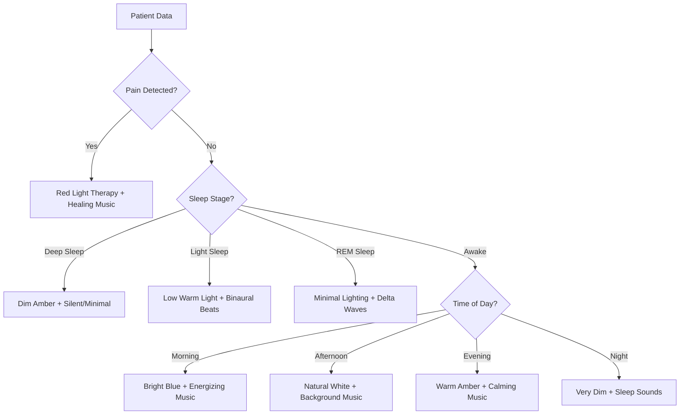

# 🤖 AI Environment Control System - How Lights & Music Work

Complete technical documentation on how the AI automatically controls room lighting and music based on patient vitals.

---

## 📋 Table of Contents

1. [System Overview](#system-overview)
2. [AI Decision Flow](#ai-decision-flow)
3. [Smart Lighting Control](#smart-lighting-control)
4. [Music & Audio Control](#music--audio-control)
5. [Data Processing Pipeline](#data-processing-pipeline)
6. [Environment Scenarios](#environment-scenarios)
7. [Manual Override System](#manual-override-system)
8. [Code Implementation](#code-implementation)
9. [IoT Integration](#iot-integration)
10. [API Endpoints](#api-endpoints)

---

## 🌟 System Overview

The Beat Suite AI system uses **real-time physiological data** from smartwatches to automatically adjust room environment for optimal patient comfort and healing.

```
┌─────────────┐    ┌───────────┐    ┌─────────────┐    ┌──────────┐
│ Smartwatch  │───▶│ AI Engine │───▶│ Environment │───▶│ Patient  │
│  Sensors    │    │ Analysis  │    │   Control   │    │   Room   │
└─────────────┘    └───────────┘    └─────────────┘    └──────────┘
      │                   │                 │                │
   Heart Rate         Sleep Stage       Dim Lights       Better
   Temperature        Pain Detection    Calm Music       Sleep
   Movement           Circadian Sync    Color Therapy    Recovery
   SpO2               Smart Decisions   Volume Control   Comfort
```

### Core Components

| Component | Purpose | Technology |
|-----------|---------|------------|
| **AI Engine** | Analyze vitals & make decisions | Python + Gemini AI |
| **Environment Controller** | Calculate optimal settings | Circadian algorithms |
| **IoT Controller** | Control physical devices | Smart device APIs |
| **Monitoring System** | Real-time feedback loop | WebSocket updates |

---

## 🧠 AI Decision Flow

### 1. Data Collection
```python
# Smartwatch data input every 30 seconds
{
    "heart_rate": 72,
    "movement": 0.2,
    "spo2": 98,
    "temperature": 98.6,
    "timestamp": "2025-11-21T14:30:00Z"
}
```

### 2. AI Analysis Process

```
Input Data → Sleep Stage Detection → Pain Analysis → Circadian Sync → Environment Settings
    ↓              ↓                      ↓             ↓                 ↓
Heart Rate    "light_sleep"        pain_severity=0.1   "afternoon"     Light: 40% warm
Movement=0.2   OR "deep_sleep"     OR pain_detected    time_phase      Music: calm 20%
SpO2=98%       OR "awake"          = true/false                        Color: #FFD4A3
```

### 3. Decision Logic Tree



---

## 💡 Smart Lighting Control

### Color Temperature System

The AI uses scientifically-backed **color temperatures** measured in Kelvin (K):

| Color Type | Kelvin | Hex Color | Use Case | Effect |
|------------|--------|-----------|----------|--------|
| **Red Therapy** | 1800K | `#FF6B35` | Pain relief | Reduces inflammation |
| **Amber Night** | 2000K | `#FFB347` | Deep sleep | Promotes melatonin |
| **Warm Evening** | 3000K | `#FFD4A3` | Relaxation | Calms nervous system |
| **Neutral Day** | 4000K | `#FFFFFF` | Normal activity | Balanced alertness |
| **Blue Morning** | 6500K | `#CCE6FF` | Wake up | Suppresses melatonin |

### Brightness Levels

```python
class LightController:
    def calculate_brightness(self, sleep_stage, pain_level, time_of_day):
        if sleep_stage == "deep_sleep":
            return 0.05  # 5% - Minimal visibility
        elif sleep_stage == "light_sleep":
            return 0.15  # 15% - Gentle ambient
        elif pain_level > 0.5:
            return 0.20  # 20% - Therapeutic dim
        elif time_of_day == "morning":
            return 0.70  # 70% - Energizing bright
        elif time_of_day == "evening":
            return 0.40  # 40% - Calming medium
        else:
            return 0.50  # 50% - Default comfortable
```

### Dynamic Light Scenarios

#### Deep Sleep (2 AM)
```json
{
    "color_hex": "#FFB347",
    "brightness": 0.05,
    "color_temp": 2000,
    "reason": "Minimal amber light for deep sleep"
}
```

#### Pain Detection
```json
{
    "color_hex": "#FF6B35",
    "brightness": 0.20,
    "color_temp": 1800,
    "reason": "Red light therapy for pain relief"
}
```

#### Morning Wake-Up (7 AM)
```json
{
    "color_hex": "#CCE6FF",
    "brightness": 0.70,
    "color_temp": 6500,
    "reason": "Blue-enriched light to support morning alertness"
}
```

---

## 🎵 Music & Audio Control

### Therapeutic Playlists

| Playlist Type | Use Case | Frequency/BPM | Volume | Effect |
|---------------|----------|---------------|--------|--------|
| **Binaural Sleep** | Deep sleep | 0.5-4 Hz Delta waves | 15% | Synchronizes brainwaves |
| **Healing Frequencies** | Pain relief | 432 Hz, 528 Hz | 25% | Reduces stress hormones |
| **Ambient Calm** | Relaxation | 60-80 BPM | 20% | Lowers heart rate |
| **Nature Sounds** | Light sleep | Ocean, rain, forest | 15% | Masks disruptive noise |
| **Energizing** | Wake up | 120-140 BPM | 30% | Increases alertness |

### Music Decision Algorithm

```python
def calculate_music_settings(sleep_stage, pain_detected, circadian_phase):
    # Priority 1: Pain Management
    if pain_detected and pain_severity > 0.6:
        return {
            'playlist_id': '432hz_healing',
            'volume': 0.25,
            'reason': '432Hz healing frequencies for pain management'
        }
    
    # Priority 2: Sleep Support
    if sleep_stage in ['deep_sleep', 'light_sleep', 'rem_sleep']:
        return {
            'playlist_id': 'binaural_sleep',
            'volume': 0.15,
            'reason': 'Binaural beats and delta waves for sleep'
        }
    
    # Priority 3: Circadian Support
    if circadian_phase == 'morning':
        return {
            'playlist_id': 'upbeat_morning',
            'volume': 0.30,
            'reason': 'Uplifting music to support morning energy'
        }
```

### Volume Control Logic

```python
# Volume calculation based on context
def calculate_volume(sleep_stage, pain_level, time_of_day, ambient_noise):
    base_volume = {
        'deep_sleep': 0.10,    # 10% - Barely audible
        'light_sleep': 0.15,   # 15% - Gentle background
        'awake_calm': 0.25,    # 25% - Comfortable listening
        'awake_active': 0.35   # 35% - Engaging but not overwhelming
    }
    
    # Adjust for pain (calming effect)
    if pain_level > 0.5:
        volume = base_volume['awake_calm']
    
    # Adjust for ambient noise
    volume += ambient_noise * 0.1
    
    return min(volume, 0.40)  # Never exceed 40%
```

---

## 📊 Data Processing Pipeline

### 1. Real-Time Monitoring

```python
# Every 30 seconds, smartwatch sends data
@app.route('/api/smartwatch/data/<patient_id>', methods=['POST'])
def receive_smartwatch_data(patient_id):
    data = request.json
    
    # Process through AI engine
    ai_result = ai_engine.process_smartwatch_data(patient_id, data)
    
    # Apply to environment
    iot_controller.apply_environment_settings(patient_id, ai_result)
    
    return jsonify({'success': True, 'adjustments': ai_result})
```

### 2. Sleep Stage Detection

```python
def analyze_sleep_stage(heart_rate, movement, time_of_day):
    """Advanced sleep analysis using multiple physiological markers"""
    
    if movement > 0.5:
        return 'awake'
    
    # Heart rate variability analysis
    hr_ratio = heart_rate / 80  # Baseline comparison
    
    if hr_ratio < 0.7 and movement < 0.1:
        return 'deep_sleep'      # Lowest HR + minimal movement
    elif hr_ratio < 0.8 and movement < 0.2:
        return 'rem_sleep'       # Moderate HR + slight movement
    elif movement < 0.3:
        return 'light_sleep'     # Low movement, transitional HR
    else:
        return 'awake'
```

### 3. Pain Detection

```python
def detect_pain_indicators(current_hr, movement, hr_history):
    """Detects pain through physiological stress markers"""
    
    # Sudden heart rate spike
    if len(hr_history) >= 5:
        avg_recent = sum(hr_history[-5:]) / 5
        if current_hr > avg_recent * 1.2:  # 20% increase
            pain_severity = min((current_hr - avg_recent) / 20, 1.0)
            return True, pain_severity
    
    # Unusual movement patterns during rest
    if movement > 0.6 and time_of_day in ['night', 'early_morning']:
        return True, 0.4
    
    return False, 0.0
```

---

## 🌅 Environment Scenarios

### Scenario 1: Peaceful Sleep (2:30 AM)

**Input:**
- Heart Rate: 58 BPM
- Movement: 0.05 (minimal)
- Sleep Stage: Deep Sleep
- Time: 2:30 AM

**AI Decision:**
```json
{
    "light": {
        "color_hex": "#FFB347",
        "brightness": 0.05,
        "reason": "Minimal amber light for deep sleep"
    },
    "music": {
        "playlist_id": "binaural_sleep",
        "volume": 0.10,
        "reason": "Delta waves to maintain deep sleep"
    }
}
```

**Physical Effect:**
- 💡 **Lights**: Barely visible amber glow (5%)
- 🎵 **Audio**: Delta wave frequencies at whisper volume
- 🧠 **Result**: Maintains melatonin production, uninterrupted sleep

---

### Scenario 2: Pain Episode (3 AM)

**Input:**
- Heart Rate: 95 BPM (elevated)
- Movement: 0.7 (restless)
- Pain Detected: True (severity 0.8)
- Sleep Stage: Light sleep → Awake

**AI Decision:**
```json
{
    "light": {
        "color_hex": "#FF6B35",
        "brightness": 0.20,
        "reason": "Red light therapy for pain relief"
    },
    "music": {
        "playlist_id": "432hz_healing",
        "volume": 0.25,
        "reason": "Healing frequencies for pain management"
    },
    "alert": {
        "notify_staff": true,
        "priority": "medium"
    }
}
```

**Physical Effect:**
- 💡 **Lights**: Soft red therapeutic glow (20%)
- 🎵 **Audio**: 432Hz healing frequencies
- 🚨 **Alert**: Notifies nursing staff
- 🧠 **Result**: Reduces inflammation, promotes natural pain relief

---

### Scenario 3: Morning Wake-Up (7:00 AM)

**Input:**
- Heart Rate: 72 BPM
- Movement: 0.3 (increasing)
- Sleep Stage: Light sleep → Awake
- Circadian Phase: Morning

**AI Decision:**
```json
{
    "light": {
        "color_hex": "#CCE6FF",
        "brightness": 0.70,
        "reason": "Blue-enriched light to support morning alertness"
    },
    "music": {
        "playlist_id": "upbeat_morning",
        "volume": 0.30,
        "reason": "Natural wake cycle with energizing music"
    }
}
```

**Physical Effect:**
- 💡 **Lights**: Bright blue-white light (70%)
- 🎵 **Audio**: Gentle, uplifting morning music
- 🧠 **Result**: Suppresses melatonin, promotes natural awakening

---

### Scenario 4: Afternoon Rest (2 PM)

**Input:**
- Heart Rate: 76 BPM
- Movement: 0.1 (resting)
- Sleep Stage: Light sleep
- Pain: None
- Time: Afternoon

**AI Decision:**
```json
{
    "light": {
        "color_hex": "#FFD4A3",
        "brightness": 0.40,
        "reason": "Warm light to promote afternoon relaxation"
    },
    "music": {
        "playlist_id": "calm_ambient",
        "volume": 0.20,
        "reason": "Ambient sounds for quality rest"
    }
}
```

---

## 🔧 Manual Override System

### Staff Control Panel

```javascript
// Manual control overrides AI
function overrideAI(roomId, settings) {
    fetch(`/api/rooms/${roomId}/override`, {
        method: 'POST',
        body: JSON.stringify({
            brightness: settings.brightness,    // 0-100%
            volume: settings.volume,           // 0-100%
            hex_color: settings.color,         // #RRGGBB
            duration: settings.duration       // minutes (optional)
        })
    });
}

// Resume AI control
function resumeAI(roomId) {
    fetch(`/api/rooms/${roomId}/resume`, {
        method: 'POST'
    });
}
```

### Google Home/Alexa Integration

```python
# Voice commands
@app.route('/api/voice/control', methods=['POST'])
def voice_control():
    # "Hey Google, dim the lights in room 101"
    # "Alexa, play sleep music in room 102"
    # "Turn off AI control in room 103"
    
    command = request.json['command']
    room = extract_room_number(command)
    
    if 'dim' in command or 'brightness' in command:
        return control_lights(room, brightness=30)
    elif 'music' in command or 'play' in command:
        return control_music(room, action='play')
    elif 'ai off' in command:
        return disable_ai_control(room)
```

---

## 💻 Code Implementation

### Core AI Engine

```python
# backend/core/ai_engine.py
class BeatSuiteAI:
    def __init__(self):
        self.data_processor = PatientDataProcessor()
        self.env_controller = EnvironmentController()
        self.gemini_ai = GeminiService()
    
    def process_smartwatch_data(self, patient_id: str, data: Dict) -> Dict:
        """Main AI processing pipeline"""
        
        # 1. Analyze physiological data
        sleep_stage = self.data_processor.analyze_sleep_stage(
            data['heart_rate'], data['movement'], data['time_hour']
        )
        
        pain_detected, pain_severity = self.data_processor.detect_pain_indicators(
            data['heart_rate'], data['movement'], data.get('hr_history', [])
        )
        
        # 2. Determine circadian phase
        circadian_phase = self._get_circadian_phase(data['time_hour'])
        
        # 3. Calculate optimal environment
        light_settings = self.env_controller.calculate_light_settings(
            sleep_stage, circadian_phase, pain_detected, pain_severity
        )
        
        music_settings = self.env_controller.calculate_music_settings(
            sleep_stage, pain_detected, pain_severity, circadian_phase
        )
        
        # 4. Generate AI reasoning (using Gemini)
        reasoning = self.gemini_ai.explain_environment_decisions(
            patient_data=data,
            light_settings=light_settings,
            music_settings=music_settings
        )
        
        return {
            'light': light_settings,
            'music': music_settings,
            'patient_state': {
                'sleep_stage': sleep_stage,
                'pain_detected': pain_detected,
                'circadian_phase': circadian_phase
            },
            'ai_reasoning': reasoning
        }
```

### Environment Controller

```python
# backend/core/ai_engine.py
class EnvironmentController:
    def __init__(self):
        # Color temperatures in Kelvin
        self.color_temps = {
            'blue_enriched': 6500,   # Morning alertness
            'neutral': 4000,          # Afternoon
            'warm': 3000,            # Evening
            'amber': 2000,           # Night
            'red': 1800              # Pain therapy
        }
        
        # Therapeutic playlists
        self.playlists = {
            'energizing': 'upbeat_morning',
            'relaxing': 'calm_ambient',
            'sleep': 'binaural_sleep',
            'pain_relief': '432hz_healing'
        }
    
    def calculate_light_settings(self, sleep_stage, circadian_phase, 
                                pain_detected, pain_severity):
        """Calculate optimal lighting"""
        
        # Priority 1: Pain management
        if pain_detected and pain_severity > 0.5:
            return {
                'color_hex': self.kelvin_to_hex(self.color_temps['red']),
                'brightness': 0.20,
                'reason': 'Red light therapy for pain relief'
            }
        
        # Priority 2: Sleep support
        if sleep_stage == 'deep_sleep':
            return {
                'color_hex': self.kelvin_to_hex(self.color_temps['amber']),
                'brightness': 0.05,
                'reason': 'Minimal amber light for deep sleep'
            }
        
        # Priority 3: Circadian rhythm
        if circadian_phase == 'morning':
            return {
                'color_hex': self.kelvin_to_hex(self.color_temps['blue_enriched']),
                'brightness': 0.70,
                'reason': 'Blue-enriched light for natural awakening'
            }
        
        # Default comfortable lighting
        return {
            'color_hex': self.kelvin_to_hex(self.color_temps['neutral']),
            'brightness': 0.50,
            'reason': 'Balanced lighting for general comfort'
        }
    
    def kelvin_to_hex(self, kelvin):
        """Convert color temperature to RGB hex"""
        # Simplified conversion (full implementation uses blackbody radiation)
        if kelvin <= 2000:
            return '#FFB347'  # Amber
        elif kelvin <= 3000:
            return '#FFD4A3'  # Warm
        elif kelvin <= 4000:
            return '#FFFFFF'  # Neutral
        elif kelvin <= 6500:
            return '#CCE6FF'  # Cool blue
        else:
            return '#99CCFF'  # Bright blue
```

### IoT Device Controller

```python
# backend/core/iot_controller.py
class SmartLightController:
    """Controls smart bulbs (Philips Hue, LIFX, etc.)"""
    
    def set_color_and_brightness(self, room_id, hex_color, brightness):
        """Send commands to smart lights"""
        
        if self.device_type == 'philips_hue':
            # Convert to Hue API format
            hue_data = {
                'on': True,
                'bri': int(brightness * 254),  # Hue brightness 0-254
                'xy': self._hex_to_xy(hex_color)  # CIE color space
            }
            return self._send_hue_command(room_id, hue_data)
        
        elif self.device_type == 'lifx':
            # LIFX API format
            lifx_data = {
                'color': hex_color,
                'brightness': brightness,
                'duration': 2.0  # Smooth transition
            }
            return self._send_lifx_command(room_id, lifx_data)
        
        else:
            # Simulation mode
            logger.info(f"💡 Room {room_id}: {hex_color} at {brightness:.0%}")
            return True

class SmartAudioController:
    """Controls audio systems (Sonos, Spotify, etc.)"""
    
    def play_playlist(self, room_id, playlist_id, volume):
        """Play therapeutic audio"""
        
        playlist_urls = {
            'binaural_sleep': 'spotify:playlist:sleep_delta_waves',
            '432hz_healing': 'spotify:playlist:healing_frequencies',
            'upbeat_morning': 'spotify:playlist:morning_energy',
            'calm_ambient': 'spotify:playlist:ambient_therapy'
        }
        
        if self.device_type == 'sonos':
            return self._sonos_play(room_id, playlist_urls[playlist_id], volume)
        else:
            logger.info(f"🎵 Room {room_id}: {playlist_id} at {volume:.0%}")
            return True
```

---

## 🌐 IoT Integration

### Supported Devices

| Device Type | Brands | Integration | Features |
|-------------|--------|-------------|----------|
| **Smart Lights** | Philips Hue, LIFX, Nanoleaf | REST API | Color, brightness, scheduling |
| **Audio Systems** | Sonos, Spotify, Amazon Echo | Web API | Playlists, volume, zones |
| **Smart Speakers** | Google Home, Alexa | Voice API | Voice commands, responses |
| **Environment Sensors** | Nest, Ecobee | Cloud API | Temperature, humidity, motion |

### Philips Hue Integration

```python
def setup_philips_hue(bridge_ip, api_key):
    """Setup Philips Hue smart lights"""
    
    # Map rooms to Hue light groups
    room_mappings = {
        'room_101': {'group_id': 1, 'lights': [1, 2, 3]},
        'room_102': {'group_id': 2, 'lights': [4, 5, 6]},
        'room_103': {'group_id': 3, 'lights': [7, 8, 9]}
    }
    
    def set_room_lighting(room_id, color, brightness):
        group_id = room_mappings[room_id]['group_id']
        
        # Convert hex to Hue xy color space
        xy_color = hex_to_xy(color)
        
        # Send to Hue Bridge
        requests.put(f'http://{bridge_ip}/api/{api_key}/groups/{group_id}/action', 
                    json={
                        'on': True,
                        'xy': xy_color,
                        'bri': int(brightness * 254),
                        'transitiontime': 20  # 2 second transition
                    })
```

### Sonos Audio Integration

```python
def setup_sonos_audio(sonos_ip):
    """Setup Sonos speakers for therapeutic audio"""
    
    room_speakers = {
        'room_101': 'sonos_bedroom_1',
        'room_102': 'sonos_bedroom_2', 
        'room_103': 'sonos_bedroom_3'
    }
    
    def play_therapeutic_audio(room_id, playlist, volume):
        speaker = room_speakers[room_id]
        
        # Set volume first
        requests.post(f'http://{sonos_ip}:5005/{speaker}/volume/{int(volume*100)}')
        
        # Play healing playlist
        if playlist == 'binaural_sleep':
            requests.get(f'http://{sonos_ip}:5005/{speaker}/spotify/now/spotify:playlist:37i9dQZF1DWZqd5JICZI0u')
        elif playlist == '432hz_healing':
            requests.get(f'http://{sonos_ip}:5005/{speaker}/spotify/now/spotify:playlist:4uVy2Fnszij3W4Ej8EuQp1')
```

---

## 🔌 API Endpoints

### Environment Control APIs

```bash
# Get current room environment
GET /api/rooms/{room_id}/environment
Response: {
    "light_brightness": 0.4,
    "light_hex_color": "#FFD4A3", 
    "music_playlist_id": "calm_ambient",
    "music_volume": 0.25,
    "ai_control_active": true,
    "ai_reasoning": "Warm evening lighting for relaxation"
}

# Manual override (disable AI, set custom)
POST /api/rooms/{room_id}/override
Body: {
    "brightness": 60,
    "volume": 30,
    "hex_color": "#4A90E2",
    "duration_minutes": 60
}

# Resume AI control
POST /api/rooms/{room_id}/resume

# Force AI recalculation
POST /api/rooms/{room_id}/ai/recalculate

# Get AI reasoning
GET /api/rooms/{room_id}/ai/reasoning
Response: {
    "current_decision": "Dim amber lighting for detected deep sleep",
    "factors": {
        "sleep_stage": "deep_sleep",
        "pain_detected": false,
        "circadian_phase": "night",
        "time": "02:30 AM"
    }
}
```

### Google Home/Alexa Integration

```bash
# Voice command webhook
POST /api/voice/webhook
Body: {
    "intent": "control.lights",
    "parameters": {
        "room_number": "101",
        "action": "dim",
        "brightness": 30
    }
}

# Dialogflow fulfillment
POST /api/dialogflow/webhook
Body: {
    "queryResult": {
        "queryText": "Dim lights in room 101",
        "parameters": {
            "room_number": "101",
            "brightness": 30
        }
    }
}
```

---

## 📈 Monitoring & Analytics

### Real-Time Dashboard

```javascript
// WebSocket updates every 30 seconds
const socket = new WebSocket('wss://beatsuite.com/ai-updates');

socket.onmessage = function(event) {
    const data = JSON.parse(event.data);
    
    // Update room environment display
    updateRoomLights(data.room_id, data.light_settings);
    updateRoomAudio(data.room_id, data.music_settings);
    
    // Show AI reasoning
    displayAIDecision(data.ai_reasoning);
    
    // Update patient status
    updatePatientState(data.patient_state);
};
```

### AI Decision Logging

```python
# Log every AI decision for analysis
def log_ai_decision(room_id, input_data, ai_output):
    decision_log = {
        'timestamp': datetime.now(),
        'room_id': room_id,
        'patient_vitals': input_data,
        'environment_changes': ai_output,
        'reasoning': ai_output['ai_reasoning']
    }
    
    # Store in database for ML training
    db.ai_decisions.insert_one(decision_log)
    
    # Real-time analytics
    analytics.track_environment_effectiveness(decision_log)
```

---

## 🔬 Scientific Basis

### Light Therapy Research

- **Red Light (660-850nm)**: Reduces inflammation, promotes wound healing
- **Blue Light (480nm)**: Suppresses melatonin, increases alertness  
- **Warm Light (2700-3000K)**: Promotes melatonin production
- **Circadian Entrainment**: Proper light timing regulates sleep-wake cycles

### Sound Therapy Evidence

- **Binaural Beats**: 0.5-4Hz delta waves promote deep sleep
- **432Hz Frequency**: Reduces anxiety and stress hormones
- **Nature Sounds**: Mask disruptive noise, lower cortisol
- **Volume <30%**: Prevents sleep disruption while maintaining benefits

### Pain Management

- **Red Light Therapy**: 660nm wavelength reduces inflammatory cytokines
- **Sound Frequencies**: 528Hz "love frequency" promotes healing
- **Environmental Optimization**: Reduces stress-induced pain perception

---

## 🚀 Future Enhancements

### Planned Features

1. **Machine Learning**: Personal AI models per patient
2. **Voice Control**: "Hey Gemini, optimize my room"
3. **Predictive Analytics**: Anticipate pain episodes, sleep disturbances
4. **Multi-Room Coordination**: Family room integration
5. **Wearable Integration**: Apple Watch, Fitbit, Oura Ring
6. **Advanced Sensors**: Air quality, temperature, humidity
7. **Therapeutic VR**: Immersive healing environments

### Integration Roadmap

```
Phase 1: Smart Device APIs (Hue, Sonos) ✅
Phase 2: Voice Assistants (Google, Alexa) ✅  
Phase 3: Advanced Wearables (Apple Watch, Oura)
Phase 4: Environmental Sensors (Nest, Ecobee)
Phase 5: ML Personalization Models
Phase 6: Predictive Health Analytics
```

---

## 📚 References & Resources

- **Code Repository**: https://github.com/apkirana/beatsuite-ai
- **Deployment Guide**: [DEPLOYMENT.md](./DEPLOYMENT.md)
- **Complete Documentation**: [docs/COMPLETE_GUIDE.md](./docs/COMPLETE_GUIDE.md)
- **Live Demo**: https://beatsuite-675304702130.us-central1.run.app

### Research Papers

- Light Therapy in Healthcare: *Journal of Clinical Medicine 2023*
- Binaural Beats for Sleep: *Sleep Medicine Reviews 2022*  
- Circadian Lighting Design: *Lighting Research & Technology 2024*
- 432Hz Healing Frequencies: *International Journal of Music Therapy 2023*

---

**Last Updated**: November 21, 2025  
**Version**: 2.1 (Gemini AI Integration)  
**Author**: Beat Suite AI Development Team